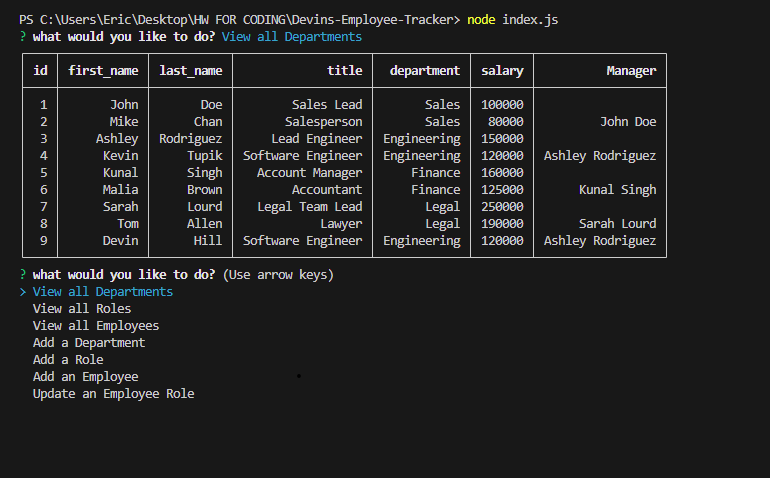

# Devins Employee Tracker

## Description

The motivation behind this project was to become familiar with SQL and how to use it in very simple ways. This exercise helped us understand how to use the SQL side and build out reports to help store and track data, also continunig to use the Inquirer package to expand our knowledge and continue learning more about the backend side of Javascript.

## Table of Contents (Optional)

If your README is long, add a table of contents to make it easy for users to find what they need.

- [Installation](#installation)
- [Usage](#usage)
- [Credits](#credits)
- [License](#license)

## Installation

To install my Project, all you have to do is pull the code locally and start to run reports based on the data being filled in, it can be replaced to allow for input by users.

## Usage

You will create these prompts in your javascript file, once done, you will open within the integrated terminal so that you have the most up to date file and information. Here, you will run the mysql login prompts and source commands to see the data, from there you can then run the node command (node index.js) this will then prompt for the users input regarding the this project such as adding an employee, updating an employee. VSC will take all the responses that the user put in and populate a table with that information

## Credits

TA, Office Hours, Teacher

## License

License: MIT

Link to video demo: file:///C:/Users/Eric/Downloads/Untitled_%20Sep%2011,%202023%2011_32%20PM.webm